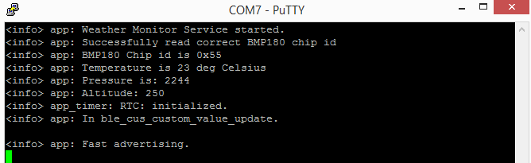

# BLE Weather Monitor
**Author:** MrMarshy

**Category:** Embedded Systems - Bluetooth Low Energy (IoT)

**Date:** 23rd July 2021

----------------------------------------------------------------------

### Project Description
The nRF52840 microcontroller is configured as a Bluetooth Low Energy peripheral devce. It reads temperature and 
pressure sensor data from the BMP180 sensor over I2C and sends the data to a Bluetooth Low Energy device 
configured as a central. The central must enable Bluetooth Low Energy notifications on the nRF52840 to start 
receiving sensor data. The central device can request either pressure or temperature reading by writing a 0x01 
(temperature) or 0x02 (pressure) to the nRF52840.

----------------------------------------------------------------------

### Aim of the Project
The aim of the project is to produce an IoT weather station using BMP180 temperature and pressure sensor using
Bluetooth Low Energy to deliver the weather data to interested clients. 

----------------------------------------------------------------------

### Project Diagrams

#### Project Block Diagram(s)

#### Sensor Measurement Flowchart

#### Screenshots

#### Project UML Diagrams
TBC

#### Project Circuit Diagram
TBC

----------------------------------------------------------------------

### Project Construction
TBC

----------------------------------------------------------------------

### Suggestions for Additional Work
TBC

----------------------------------------------------------------------
### Installation/Tutorials

Follow the guide at [nRF52-Bluetooth-Course](https://github.com/NordicPlayground/nRF52-Bluetooth-Course) to 
create a custom bluetooth low energy service.

TBC
----------------------------------------------------------------------

## References
1. [IoT Projects with Arduino Nano 33 BLE Sense](https://www.apress.com/gp/book/9781484264577)
2. [nRF5x-custom-ble-service-tutorial](https://github.com/NordicPlayground/nRF5x-custom-ble-service-tutorial)
3. [nRF52-Bluetooth-Course](https://github.com/NordicPlayground/nRF52-Bluetooth-Course)